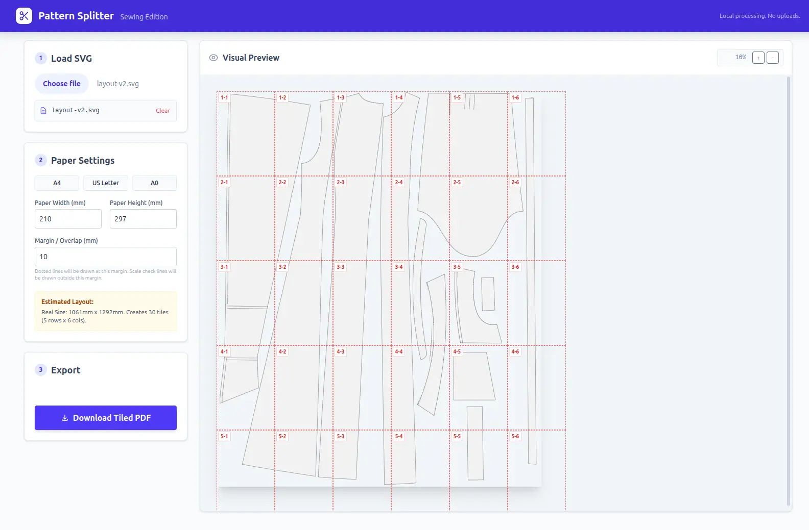

# Pattern Splitter

A simple, browser-based tool to split large sewing pattern SVGs into printable A4, Letter, or A0 PDF tiles.



## Features

-   **Client-Side Processing:** All processing happens locally in your browser. No files are uploaded to any server.
-   **SVG Support:** Load any standard SVG sewing pattern.
-   **Auto-Tiling:** Automatically calculates the number of tiles needed based on your paper settings.
-   **Configurable Paper Sizes:**
    -   Presets for A4, US Letter, and A0.
    -   Custom dimensions supported.
-   **Smart Layout:**
    -   **Margins & Overlaps:** Configurable overlap margins for easy assembly.
    -   **Alignment Marks:** Automatically adds diamond alignment marks on overlapping edges to assist with taping.
    -   **Scale Verification:** Adds a 5cm verification ruler (corner check) on every tile to ensure print accuracy.
-   **Tile Labeling:** Each page is clearly labeled with its row and column (e.g., Tile 1-1, 1-2).
-   **Visual Preview:**
    -   Interactive preview of the pattern.
    -   Grid overlay showing exactly how the pages will be split.
    -   Zoom controls to inspect details.
-   **PWA (Progressive Web App):**
    -   Installable on desktop and mobile.
    -   Works offline once installed.

## How to Use

1.  **Open the App:** Navigate to the hosted URL.
2.  **Load SVG:** Click the "Choose SVG file" button to select your pattern file.
3.  **Configure:**
    -   Select your target paper size (e.g., A4).
    -   Adjust margins if necessary (default 10mm overlap).
4.  **Preview:** Check the "Visual Preview" on the right to see the tile grid.
5.  **Export:** Click "Download Tiled PDF".
    -   If prompted, you can install the app for offline use after the export.

## Privacy

This tool runs entirely in your browser. **No data is sent to the cloud.** Your pattern files remain on your device.

## Development

Built with:
-   **Vite** (Framework agnostic build tool)
-   **TypeScript**
-   **Tailwind CSS**
-   **jsPDF** & **svg2pdf.js** (PDF generation)
-   **Vite PWA Plugin**

### Setup

```bash
# Install dependencies
npm install

# Run development server
npm run dev

# Build for production
npm run build
```
